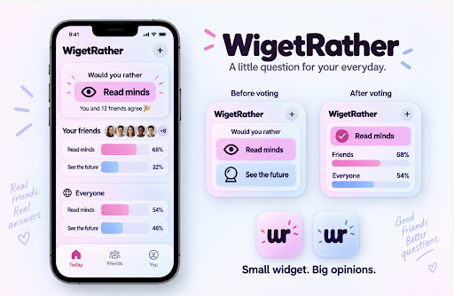
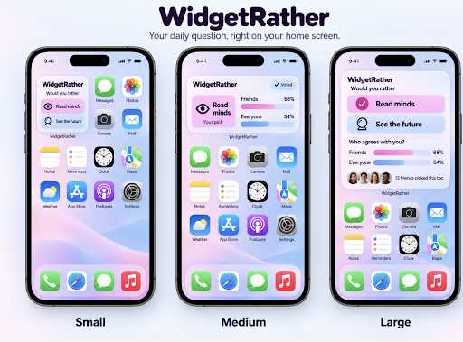

# Mockups

Early concept mockups added by Noah on 2026-09-10. These are for direction and vibe, not final designs (Noah owns the final designs, per D-017).

| File | What it shows |
|---|---|
| `01-concept-app-and-widget-states.png` | App "Today" screen (question, your friends' split, everyone's split), the widget before voting vs after voting, app icon options. Taglines: "A little question for your everyday", "Small widget. Big opinions." |
| `02-widget-sizes.png` | The widget on an iPhone home screen in small, medium, and large sizes. Tagline: "Your daily question, right on your home screen." |

## Notes for the team
- **Spelling:** mockup 01 spells the name **"WigetRather"** (missing the "d"); mockup 02 has "WidgetRather". Use **WidgetRather** / Widget Rather.
- **Before/after voting widget states** match the MVP: answer on the widget, then see the split (D-008).
- **"Everyone" stats** (the % across all users, next to "Friends") are **not in the MVP scope yet** (D-008 only has your group's %). Decide whether to add them.
- **Lock-screen reminder:** on iOS, lock-screen widget buttons are inactive until the phone is unlocked, so voting happens on the home-screen widget ([research/tech-stack.md](../../research/tech-stack.md)).
- **Images:** keep widget images tiny in the real build (~2MB images crashed Raroque's widget, `9sHd-VWssxw @ 02:04`).
